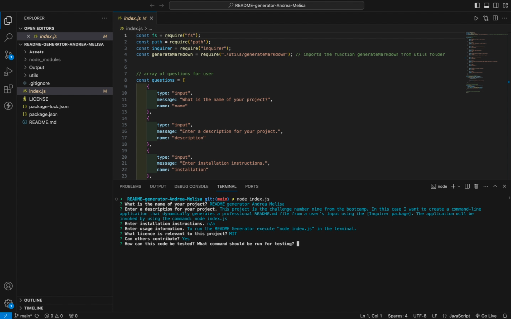
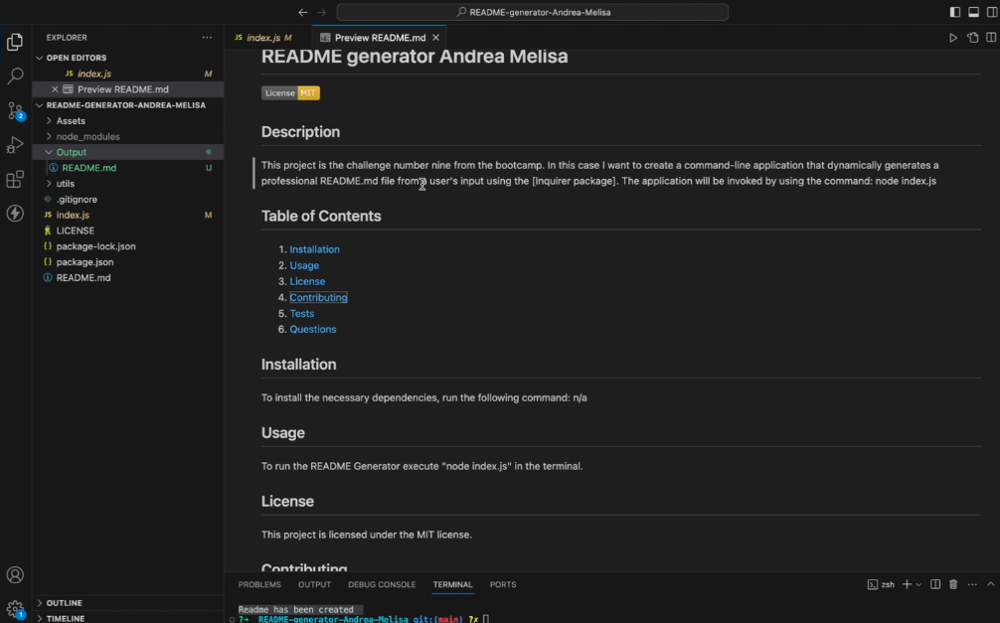

# README generator Andrea Melisa

  

  ## Description

This project is the challenge number nine from the bootcamp. In this case I want to create a command-line application that dynamically generates a professional README.md file from a user's input using the [Inquirer package]. The application will be invoked by using the command:
node index.js

## Acceptance Criteria

* Create a command-line application that accepts user input.
  * When a user is prompted for information about the application repository then a high-quality, professional README.md is generated with:
    * The title of my project 
    * Sections entitled:
      * Description 
      * Table of Contents 
      * Installation 
      * Usage 
      * License 
      * Contributing 
      * Tests 
      * Questions
    * When a user enters the project title then it is displayed as the title of the README
    * When a user enters a description, installation instructions, usage information, contribution guidelines, and test instructions then this information is added to the sections of the README entitled Description, Installation, Usage, Contributing, and Tests
    * When a user chooses a license for their application from a list of options then a badge for that license is added near the top of the README and a notice is added to the section of the README entitled **License** that explains which license the application is covered under
    * When a user enters their GitHub username then this is added to the section of the README entitled Questions, with a link to their GitHub profile
    * When a user enters their email address then this is added to the section of the README entitled Questions, with instructions on how to reach them with additional questions
    * When a user clicks on the links in the **Table of Contents** then they are taken to the corresponding section of the README

  ## Table of Contents
  1. [Installation](#installation)
  2. [Usage](#usage)
  3. [License](#license)
  4. [Contributing](#contributing)
  5. [Tests](#tests)
  6. [Credits](#credits)
  7. [Badges](#badges)
  8. [Questions](#questions)

  ## Installation
  n/a

  ## Usage
  To run the README Generator execute "node index.js" in the terminal.
  Here you have a link to the demo video: https://drive.google.com/file/d/1f-reN-6FPSp70S0ivM4iYFepDYabJVdF/view
  
  
  Here you have a few screenshots of the process:

  ## License 
  This project is licensed under the MIT license.

  ## Contributing
  Yes.

  ## Tests
  No specific tests have been written for this project yet.

  ## Credits
  Thanks to the instructor Laura Cole and to the TA Martin William from EDX for all their knowledge and support. Thank you for the tutor Juan Delgado and a big thank you to Marcos Z. as allways.

  Sources:
  https://shields.io/badges

  https://gist.github.com/lukas-h/2a5d00690736b4c3a7ba

  https://coding-boot-camp.github.io/full-stack/github/professional-readme-guide

  ## Badges
  
  
  

  ## Questions
  If you have any questions about this repo you can contact me directly at [andream_dearth@hotmail.com](mailto:andream_dearth@hotmail.com). Here you can find more of my work at [Andrea-Melisa](https://www.github.com/Andrea-Melisa).
